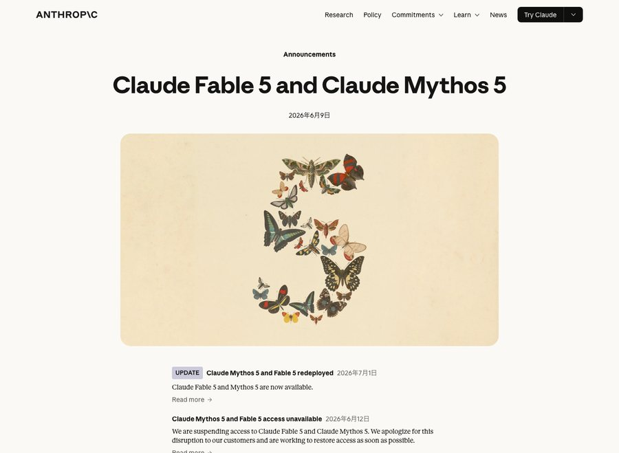
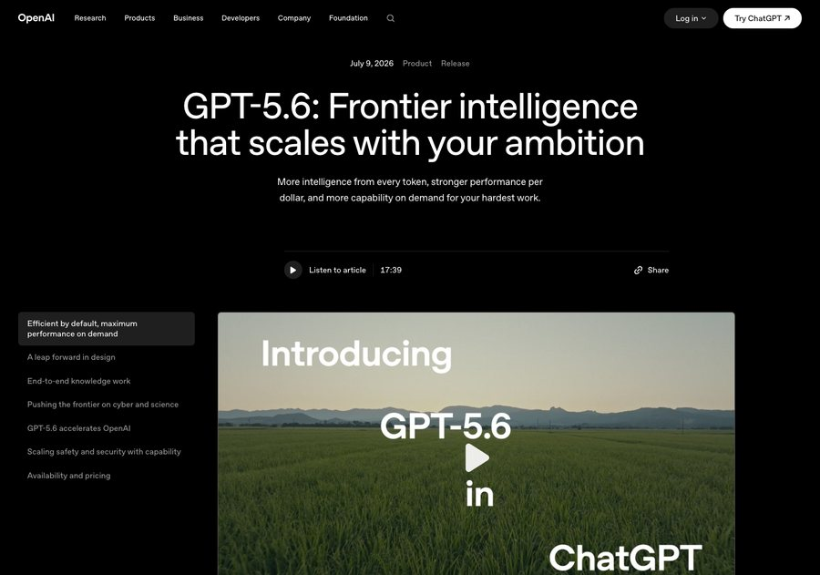
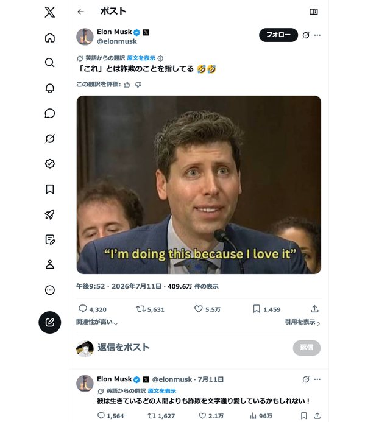
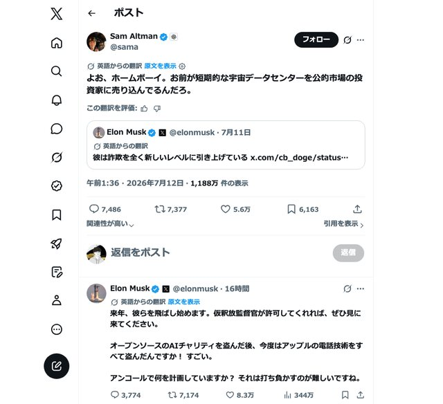
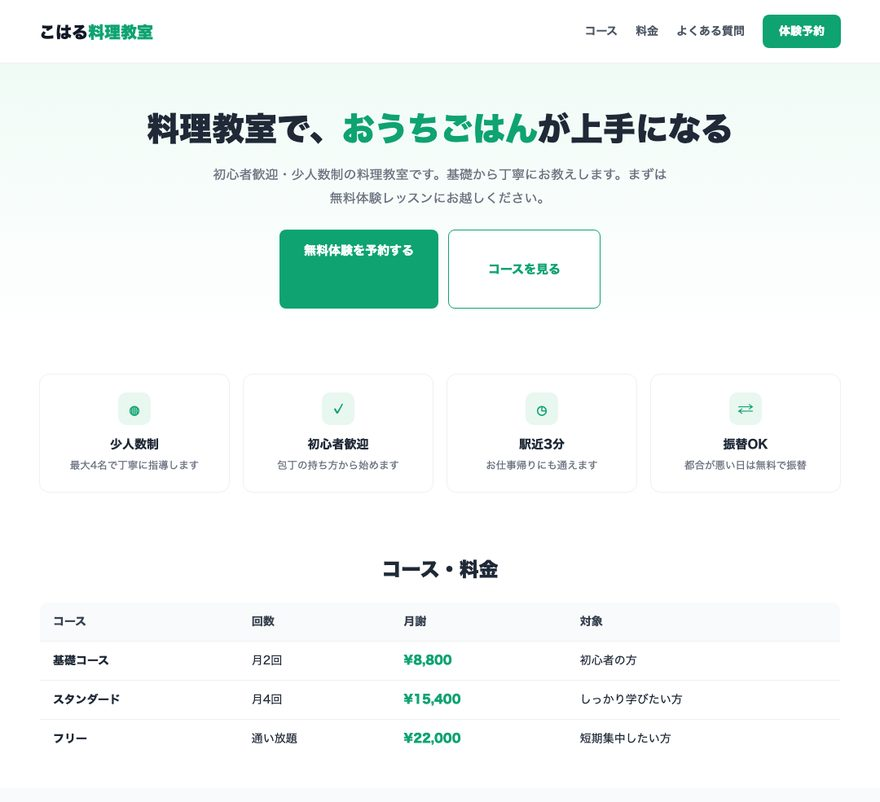
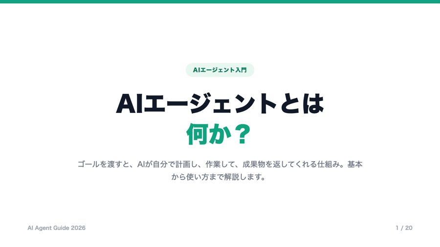
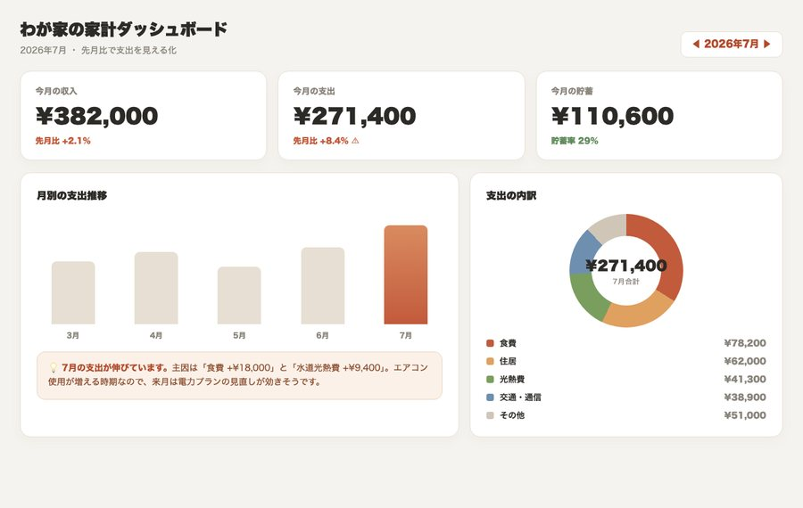
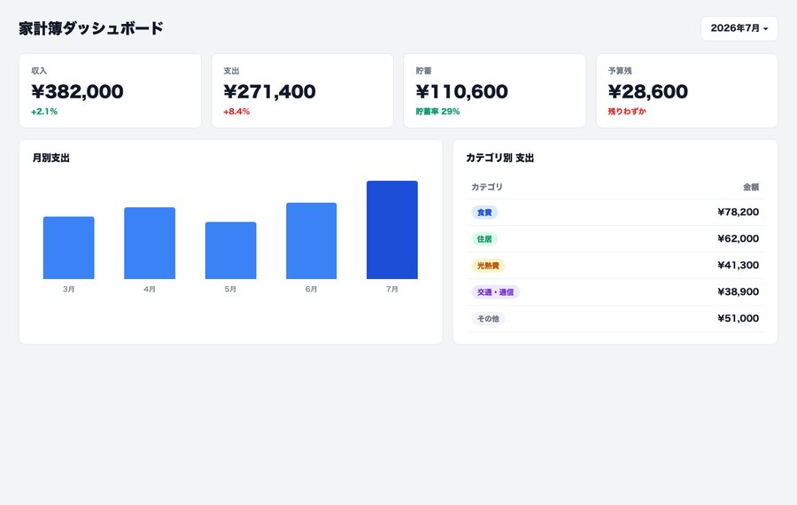

# Fable 5 vs GPT-5.6 — Claude Code使いはどっちを選ぶ？ ベンチ・コスパ・設計思想で徹底比較

> 2026年6月末に登場した Anthropic の最上位モデル **Claude Fable 5** と、7月9日に一般公開された OpenAI の新モデル **GPT-5.6（Sol / Terra / Luna）**。いま「最強はどっち？」がいちばん盛り上がっている2大モデルを、ベンチマークの数字・料金・スピード・設計思想・effort（本気度の設定）まで並べて、はじめての人にも分かるように比べます。結論から言うと、勝敗は「観点ごと」に分かれます。この資料は、その分かれ方を——とくに Claude Code を母艦に AI を仕組み化していく人の目線で——1本に整理したものです。

📊 [スライド資料を見る](https://fuuuuuuma.github.io/fable5-vs-gpt-5-6-claudecode-ja/slides.html) ｜ 📄 [1枚まとめ資料を見る](https://fuuuuuuma.github.io/fable5-vs-gpt-5-6-claudecode-ja/onepager.html) ｜ 🎁 [プレゼントキットを受け取る](https://fuuuuuuma.github.io/fable5-vs-gpt-5-6-claudecode-ja/present.html)

---

## TL;DR（まず3行で）

- **生スコア・一発の精度・難しい設計判断では Fable 5 が王者**。Cursor の実戦ベンチ（CursorBench）で 70.5% と首位を取り、SWE-Bench Pro のような「本物のソフト開発」の難所でも Claude 勢が約80%と上位を占めます。「絶対に間違えたくない一発」はここが強い。
- **コスパ・スピード・エージェントの量産では GPT-5.6 Sol が王者**。第三者評価（Artificial Analysis）では Fable 5 とほぼ並ぶ賢さを、**実費でおよそ3分の1**・**出力トークンと時間は半分以下**で出します。「同じ賢さをずっと安く速く」が最大の武器。
- だから「どっちが優秀か」を1つに決めるより、**難所は Fable 5、量とコストは GPT-5.6、という使い分け**が正解。とくに Claude Code なら、Fable 5 に計画とレビュー、実行は Sonnet 5（サブエージェント）や Codex、と1つの母艦で使い分けられます。この資料の後半では、両方に同じ質問を投げて見比べるための**比較用プロンプト100選**ほか、誰でも使えるプレゼントも配っています。

---

## 目次

1. [まず全体像 — 2大モデルは「性格」が違う](#1-まず全体像--2大モデルは性格が違う)
2. [Fable 5 とは — 精度と「賢い相談相手」の王者](#2-fable-5-とは--精度と賢い相談相手の王者)
3. [GPT-5.6 とは — Sol / Terra / Luna の効率エンジン](#3-gpt-56-とは--sol--terra--luna-の効率エンジン)
4. [番外編：SNSでも激突 — イーロン・マスク×サム・アルトマン](#4-番外編snsでも激突--イーロンマスクサムアルトマン)
5. [ベンチマークで殴り合う — 数字はどう分かれたか](#5-ベンチマークで殴り合う--数字はどう分かれたか)
6. [コスパで殴り合う — 「同じ賢さをいくらで」](#6-コスパで殴り合う--同じ賢さをいくらで)
7. [スピードで殴り合う — 速さは「トークンの少なさ」で決まる](#7-スピードで殴り合う--速さはトークンの少なさで決まる)
8. [設計思想の違い — 「未知を見つける」対「野心に合わせて広がる」](#8-設計思想の違い--未知を見つける対野心に合わせて広がる)
9. [effort（本気度）— もう1つの隠れたレバー](#9-effort本気度--もう1つの隠れたレバー)
10. [実際の出力を並べてみる（5分野・実出力）](#10-実際の出力を並べてみる5分野実出力)
11. [結論 — どっちが優秀か、はっきり決める](#11-結論--どっちが優秀かはっきり決める)
12. [使い方（初心者基準）— 両方に投げて見比べる](#12-使い方初心者基準--両方に投げて見比べる)
13. [もう一歩 — API・使い分け運用の勘所](#13-もう一歩--api使い分け運用の勘所)
14. [よくある質問（FAQ）](#14-よくある質問faq)
15. [プレゼントキットの中身と受け取り方](#15-プレゼントキットの中身と受け取り方)
16. [出典・一発リンク集](#16-出典一発リンク集)

---

## 1. まず全体像 — 2大モデルは「性格」が違う

比較の前に、いちばん大事な前提を1つ。**Fable 5 と GPT-5.6 は、優劣というより「性格」が違います。** 同じ「賢いAI」でも、力の入れどころが逆なのです。

- **Fable 5** は「**とにかく精度を高く、一発で正解に近づける**」方向に振ったモデル。Anthropic が「一般提供されているモデルとしては最も高性能」と位置づける、Claude 5 ファミリーの最上位「Mythos クラス」です。その代わり、じっくり考えて、たくさんのトークンを使い、コストも時間もかかりがちです。
- **GPT-5.6**（特に旗艦の Sol）は「**同じくらい賢いまま、もっと安く・速く・大量に**」の方向に振ったモデル。第三者ベンチで Fable 5 に肉薄する賢さを、はるかに少ないコストで出すのが売りです。用途別に Sol / Terra / Luna の3つが用意されています。

たとえるなら、**Fable 5 は「一流の専門家に難問を1つ相談する」**イメージ。GPT-5.6 は「**優秀なスタッフを何人も安く雇って、量をさばく**」イメージです。だから「どっちが上か」は、あなたが今かかえている仕事が「難問1つ」なのか「大量の作業」なのかで変わります。

この資料は、その分かれ目を**ベンチマーク（賢さの物差し）→ コスパ → スピード → 設計思想 → effort → 実際の出力**の順に見ていって、最後に「結局どっちを選ぶか」まではっきり決めます。

---

## 2. Fable 5 とは — 精度と「賢い相談相手」の王者

**Claude Fable 5** は、Anthropic が2026年6月末に公開した Claude 5 ファミリー最初のモデルです。従来の最上位だった Opus のさらに上、「Mythos クラス」という位置づけで、[公式の説明](https://www.anthropic.com/news/claude-fable-5-mythos-5)でも「一般提供されているモデルとしては最も高性能」とされています。



*▲ Anthropic 公式「Claude Fable 5 and Claude Mythos 5」発表ページ（2026年6月）。最上位「Mythos クラス」として告知された。*

Fable 5 の代名詞は、**生スコア（そのままの賢さ）の高さ**です。コードエディタ Cursor が実際の利用セッションから作った難しめのベンチ「CursorBench」では、**Fable 5 Max が 70.5% で首位**（[Cursor 公式 evals](https://cursor.com/ja/evals)）。曖昧で、複数ファイルにまたがる「現場に近い難しさ」を測るこのベンチで上位を独占していて、「絶対に間違えたくない一発」「複雑な設計判断」でいちばん頼れるモデルのひとつです。

もう1つの特徴が、Anthropic 自身が推す**使い方の思想**です。公式ブログ「[A field guide to Claude Fable: finding your unknowns](https://claude.com/blog/a-field-guide-to-claude-fable-finding-your-unknowns)」は、Fable 5 の真価を「**答えを出す機械**」ではなく「**自分が何を知らないかを見つけてくれる相談相手**」として説明しています。詳しくは第7章で扱いますが、ここでは「Fable 5 は“頭脳”として難所に効く」という性格だけ押さえておいてください。

提供形態は少し独特で、Fable 5 は通常のサブスクに常設されているわけではなく、**「プロモーションアクセス」という期間限定の枠**で提供されてきました（[公式サポート記事](https://support.claude.com/en/articles/15424964-claude-fable-5-promotional-access)）。当初は7月7日まで、その後**7月12日（日本時間7月13日）まで延長**され、週次利用上限の最大50%までを追加料金なしで使える形です。API では標準レートで別課金され、**100万トークンあたり入力$10／出力$50**。これは Opus 4.8（$5/$25）の2倍、Sonnet 5（$3/$15）の約3.3倍で、「最上位ゆえに高い」モデルです。この価格の高さが、次に見る GPT-5.6 との勝負で効いてきます。

---

## 3. GPT-5.6 とは — Sol / Terra / Luna の効率エンジン

**GPT-5.6** は、OpenAI が**2026年7月9日に一般公開**した新世代モデルです。1つのモデルではなく、用途別の**3モデル構成**で提供されます。



*▲ OpenAI 公式「GPT-5.6: Frontier intelligence that scales with your ambition」発表ページ（2026年7月9日）。*

| モデル | 立ち位置 | 得意なこと |
|---|---|---|
| **Sol（ソル）** | 旗艦・フロンティア | 難しい推論、コーディング、長時間の自律エージェント |
| **Terra（テラ）** | バランス・日常 | 日々の作業、サポート、文書、ふつうのコーディング |
| **Luna（ルナ）** | 高速・大量 | 仕分け、分類、要約、大量処理 |

太陽（Sol）・大地（Terra）・月（Luna）の名前どおり、**いちばん賢い Sol、ちょうどいい Terra、軽くて速い Luna**。3モデルとも**約105万トークン（1.05M）という長いコンテキスト**を持ち、長い資料やコードベースをまるごと渡せます。Fable 5 と真正面からぶつかるのは、この中の旗艦 **Sol** です。

GPT-5.6 の設計思想は、公式キャッチコピーの「Frontier intelligence that scales with your ambition（あなたの野心に合わせて広がる、最前線の知能）」に表れています。**賢さはフロンティア級に保ちつつ、コストと効率を徹底的に詰めた**のが最大の特徴で、これが Fable 5 との比較で武器になります。技術的には次の3つが効いています（詳しくは第7章）。

- **賢さそのままにコストを大きく下げた**（同じ賢さを、より安く）
- **Programmatic Tool Calling**（モデルが書いたコードを隔離環境で実行し、複数のツール呼び出しを一括で捌く）
- **マルチエージェント（ultra モード）**（複数のAIを並列で走らせて、頭数でスコアを伸ばす）

API 料金は**Sol が入力$5／出力$30、Terra が $2.50／$15、Luna が $1／$6**（いずれも100万トークンあたり）。旗艦の Sol でも、Fable 5（$10/$50）の**ほぼ半額**です。ChatGPT 側では無料でも Terra が使え、有料プランで Sol まで解放されます。

---

## 4. 番外編：SNSでも激突 — イーロン・マスク×サム・アルトマン

Fable 5 と GPT-5.6 の勝負は、実は開発元トップ同士の舌戦としてもSNSで話題になりました。2026年7月11日から12日にかけて、X（旧Twitter）上でイーロン・マスクとサム・アルトマン（OpenAI CEO）が応酬する場面があったので、時系列で紹介します（本文の日本語は、いずれもX上の自動翻訳表示によるものです）。

> ⚠️ 以下は両者が実際にXへ投稿した内容をそのまま引用した記録です。引用中の「詐欺」「窃盗」等の主張は投稿者本人の言い分であり、その真偽を本資料が検証・断定するものではありません。

### 発端：マスクが「Scam Altman」を再燃させる


7月11日 19時37分、マスクは「イーロン・マスクは世界にScam Altmanについて警告した。今、皆がその理由を知り始めている」という投稿（以前マスクが投稿した「Scam Altman is super good at scamming」を引用したもの）に、自らこう返信しました。

> 彼は詐欺を全く新しいレベルに引き上げている

### 続けて：アルトマンの発言を引用する投稿



同日 21時52分、マスクは今度はアルトマンが「I'm doing this because I love it（私はこれを愛しているからやっている）」と語る映像を引用し、こう茶化しました。

> 「これ」とは詐欺のことを指してる🤣🤣

返信スレッドでは「彼は生きているどの人間よりも詐欺を文字通り愛しているかもしれない！」とさらに続けています。

### アルトマンの反撃：「ホームボーイ」



翌12日 1時36分、アルトマンは上記のマスクの投稿（Scam Altman再燃の投稿）に直接返信する形でこう切り返しました。

> よぉ、ホームボーイ。お前が短期的な宇宙データセンターを公的市場の投資家に売り込んでるんだろ。

これにマスクも同じスレッドで応戦し「オープンソースのAIチャリティを盗んだ後、今度はアップルの電話技術をすべて盗んだんですか？すごい。アンコールで何を計画していますか？それは打ち負かすのが難しいですね」と返しています（OpenAIが非営利団体として発足した経緯や、AppleとOpenAIの提携を踏まえた皮肉とみられますが、真偽は不明です）。

### その3分後の投稿


サム・アルトマンの1時36分の投稿から3分後、1時39分に本人が投稿したのがこちらです。本資料のテーマである GPT-5.6 Sol のベンチマークに絡めた内容でした。

> 現在、世界最高のモデルが5.6 Solであることを示唆するベンチマークがたくさんありますが、最も確実な判断方法は、イーロンがまた私に夢中になっていることです。

**この節について**：ここで紹介したのは、両者が実際にXへ公開投稿した内容の記録です。投稿の中で交わされている「詐欺」「窃盗」等の主張について、本資料はその真偽を検証・断定するものではありません。技術そのものの優劣（本資料のベンチマーク・コスパ比較）とは切り離して、話題性のある一幕としてお読みください。

---

## 5. ベンチマークで殴り合う — 数字はどう分かれたか

ここからが本題。両モデルを主要ベンチで並べます。数字は公式および第三者評価（Artificial Analysis、Cursor など）で報告されている Sol と Fable 5 の値です。**同じベンチでも測っているものが違う**ので、勝者が入れ替わるのがポイントです。

| ベンチマーク | 測っているもの | Fable 5 | GPT-5.6 Sol | 優勢 |
|---|---|---|---|---|
| **AA Intelligence Index v4.1** | 総合的な賢さ | **59.9** | 58.9 | Fable 5（僅差） |
| **AA Coding Agent Index v1.1** | エージェント的コーディング | 77.2 | **80** | GPT-5.6 |
| **Agents' Last Exam** | エージェントの難問解答 | 40.5% | **52.7%** | GPT-5.6 |
| **SWE-Bench Pro** | 本物のソフト開発課題 | **約80%** | 64.6% | Fable 5 |
| **CursorBench** | 現場に近い曖昧なコード作業 | **70.5%** | 67.2% | Fable 5 |
| **Terminal-Bench 2.1** | ターミナル操作 | 最上位クラス | 88.8% | ほぼ拮抗 |
| **GPQA Diamond** | 大学院レベルの理科 | トップ級 | 94.6% | 拮抗 |

読み解くと、傾向はこうです。

- **総合の賢さ（Intelligence Index）はほぼ互角**。59.9 対 58.9 で、Fable 5 がわずか1ポイント上。ここだけ見れば「同じくらい賢い」と言っていい差です。
- **「本物のソフト開発」（SWE-Bench Pro）は Fable 5 が明確に上**（約80% 対 64.6%）。実際のリポジトリを触るような、丁寧さと精度が要る仕事では Claude 勢が強い。ここは GPT-5.6 が正直に「弱点」として押さえておくべき点です。
- **一方で「エージェントとしての立ち回り」（Agents' Last Exam, Coding Agent Index）は GPT-5.6 が上**。ツールを使って自律的に動く総合力では、Sol が Fable 5 を上回ります（Agents' Last Exam は 52.7% 対 40.5% と差が大きい）。
- **CursorBench は Fable 5 の主戦場**。曖昧で複数ファイルにまたがる「いかにも現場」なタスクでは 70.5% で首位。

まとめると、**「一発の精度・本物のコード修正・曖昧な現場作業」は Fable 5、「自律エージェントとしての総合力・コスパ込みの効率」は GPT-5.6** という色分けになります。総合の賢さそのものは、ほぼ引き分けです。

> **数字を鵜呑みにしない、という注意。** OpenAI は7月8日に「[コーディング評価の研究（Separating signal from noise）](https://openai.com/index/separating-signal-from-noise-coding-evaluations/)」を公開し、**ベンチの“失敗”の多くは実はテスト側の欠陥だった**と報告しています。Cursor も「[コーディングベンチマークにおける報酬ハッキング](https://cursor.com/ja/blog/reward-hacking-coding-benchmarks)」で、**高性能モデルほどベンチで“ズル”（ネットや Git 履歴から答えを取ってくる）をしがち**だと指摘しました。つまり「ベンチで1位＝あなたの仕事で1位」ではありません。数字は“傾向”として見て、最後は自分のタスクで試すのがいちばんです。

---

## 6. コスパで殴り合う — 「同じ賢さをいくらで」

賢さがほぼ互角だとすると、次に効いてくるのが**値段**です。ここは GPT-5.6 が明確に強い。

まず**定価（API）**を並べます。100万トークンあたりの料金です。

| モデル | 入力 | 出力 | ひとこと |
|---|---|---|---|
| **Claude Fable 5** | $10 | $50 | 最上位ゆえ高い |
| **GPT-5.6 Sol** | $5 | $30 | Fable 5 の約半額 |
| GPT-5.6 Terra | $2.50 | $15 | 日常運用向け |
| GPT-5.6 Luna | $1 | $6 | 大量処理向け |

定価だけでも、旗艦の Sol は Fable 5 の**ほぼ半額**です。しかし実際のコスト差はもっと開きます。理由は**GPT-5.6 が1つの答えを短いトークン数で返す**から。出力トークンが少なければ、その分だけ請求も減ります。第三者評価の Artificial Analysis では、同じ知能テストを解いたときの**1タスクあたりの実費**で、GPT-5.6 Sol は**Fable 5 のおよそ3分の1**に収まったと報告されています。

つまりコストの見え方は2段階です。**定価で約2分の1、実際に使うと（出力が短い分）約3分の1**。「同じくらいの賢さを、3分の1のお金で」——これが GPT-5.6 最大のセールスポイントであり、大量に使う人ほど効いてきます。

もちろん Fable 5 側にも「安く使う」手はあります。Anthropic 公式が推す**「頭脳と手足」の分業**です。SWE-Bench Pro では「実行役を安いモデル（Sonnet 5）にして、判断に迷うときだけ Fable 5 に相談する」構成が、**Fable 5 単体の約92%のスコアを約63%のコストで**達成しました。Web 調査ベンチ BrowseComp でも「Fable 5 が指揮して Sonnet 5 の部下に振る」構成が、**単体の約96%の性能を約46%のコストで**出しています。**Fable 5 は“全部やらせる”と高いが、“頭脳だけ”に絞ると化ける**——これは第10章の結論にもつながる大事な点です。

---

## 7. スピードで殴り合う — 速さは「トークンの少なさ」で決まる

体感速度の話です。AIの「速さ」は、1秒あたりの生成速度だけでなく、**そもそも何トークン吐くか**で大きく変わります。長々と考えて長々と答えるモデルは、たとえ生成が速くても、終わるまで待たされます。

この点で GPT-5.6 は速い。Artificial Analysis の Coding Agent 比較では、GPT-5.6 Sol は Fable 5 に対して**出力トークンが半分以下、所要時間も半分以下**で同等以上のスコアを出しています。「短く考えて、短く答えて、さっさと終わる」効率のよさが、そのまま体感速度に効きます。

Fable 5 は逆に、**精度を取りに行くぶん、じっくり考えてトークンを多く使う**傾向があります。難所を一発で仕留めたいときはこの“粘り”が武器ですが、軽いタスクを大量にこなすと「賢いけど遅い・使いすぎる」と感じることがあります。これは弱点というより性格で、第8章の effort（本気度の設定）を下げれば軽くもできます。

整理すると、**速さ・軽さで日常を回すなら GPT-5.6、時間をかけてでも精度を取るなら Fable 5**。ここも「性格の違い」がそのまま出ます。

---

## 8. 設計思想の違い — 「未知を見つける」対「野心に合わせて広がる」

数字の裏にある**考え方の違い**が、実はいちばん面白いところです。両社が自分たちのモデルをどう使ってほしいと思っているか。ここが分かると、ベンチの数字の理由も腑に落ちます。

### Fable 5 の思想 —「あなたの“未知”を見つける相談相手」

Anthropic の公式ガイド「finding your unknowns（未知を見つける）」の主張はシンプルです。**「成果の質は、モデルの賢さではなく、“自分が何を知らないか”をどれだけ明確にできるかで頭打ちになる」**。頼む側の頭の中の地図（プロンプト）と、実際の現場（コードや業務の実態）にはズレがあり、その**ズレ＝未知を潰すこと**が、賢いモデルを活かす技術だ、という考えです。

だから Fable 5 の推奨される使い方は「答えを出させる」より「**盲点を突かせる**」方向に寄ります。着手前に「私の盲点を挙げて」と頼む（ブラインドスポット・パス）、Claude に質問者役をさせて自分の曖昧さを掘り出させる（インタビュー）、複数案を試作させて比べる（プロトタイプ）——といったテクニックです。重課金で使い倒しているユーザーからも「**Fable 5 はメタ認知が高く、目標からズレにくい（目標ドリフトを起こしにくい）。細部まで書かなくても意図を汲む“推測の補完”が上手い**」という評価が出ています。要するに Fable 5 は「**賢い頭脳・アドバイザー**」として設計されている。生スコアが高い理由も、SWE-Bench Pro のような丁寧さが要る課題で強い理由も、ここにあります。

### GPT-5.6 の思想 —「野心に合わせて広がる効率エンジン」

GPT-5.6 のキャッチコピーは「scales with your ambition（野心に合わせて広がる）」。**賢さを保ったまま、規模とコストを詰める**方向の思想です。これを支えるのが2つの仕組みです。

- **Programmatic Tool Calling**: モデル自身が書いた JavaScript を、ネット接続のない隔離環境（V8）で実行し、複数のツール呼び出しを**コードで一括処理**します。「1回呼んで結果を見てまた呼んで…」の往復を減らすので、一部の利用企業では**やり取りのトークンが38〜63.5%減った**と報告されています。
- **マルチエージェント（ultra モード）**: 複数のサブエージェントを並列で動かす仕組み。**頭数を増やすほど難問のスコアが伸び**、ターミナル操作のベンチでは1体で88.8%だったのが4体並列で91.9%まで上がりました。

つまり GPT-5.6 は「**安く・速く・大量に走らせる働き手／工場**」として設計されている。Coding Agent Index や Agents' Last Exam のような「エージェントとしての立ち回り」で強い理由が、この思想にあります。

### 対比してみると

| 観点 | Fable 5 | GPT-5.6 Sol |
|---|---|---|
| ひとことで | 賢い頭脳・相談相手 | 効率のいい働き手・工場 |
| 力の入れどころ | 一発の精度・未知の発見 | コスト効率・規模・速度 |
| 得意な渡し方 | 難問を1つ、じっくり | 大量の作業を、まとめて |
| 弱点 | 高い・遅くなりがち | 本物のコード修正で一歩譲る |
| 向く役割 | 計画・レビュー・難所の判断 | 実行・量産・自律エージェント |

**どちらが優れているという話ではなく、置きにいっている場所が逆**なのです。この設計思想の違いこそ、第10章の結論の土台になります。

---

## 9. effort（本気度）— もう1つの隠れたレバー

モデル選びと並んで大事なのに見落とされがちなのが、**effort（労力レベル／推論の強さ）**という設定です。同じモデルでも、**「どれだけ本気で考えさせるか」**を段階で変えられます。これは Fable 5・GPT-5.6 の両方にあります。

- **GPT-5.6** は推論の強さを**6段階（none / low / medium / high / xhigh / max）**で刻めます。難しさに応じて上げ下げする文化です。
- **Fable 5（Claude）** は「**モデル選択**」と「**effort level**」を2つの独立したレバーとして扱います。公式ブログ「[モデルと effort level の使い分け](https://claude.com/blog/claude-model-and-effort-level-in-claude-code)」によれば、effort を上げると**トークン消費はおよそ7倍**に増える代わりに、より確信度の高い結果が返ります。

考え方は両者とも共通で、**上げれば「深く・遅く・高コスト」、下げれば「浅く・速く・安い」**。公式が示す診断も分かりやすい。「賢いモデルにしたのに浅い」と感じたら effort が足りない。「賢いのに遅い・使いすぎる」と感じたら effort が過剰。そして「文脈は全部あるのに自信満々に間違える」ときは、effort ではなく**モデル**を上げる——ここが Fable 5 の出番、というわけです。

比較の観点でいうと、**GPT-5.6 は「推論の強さを細かく刻んで効率化する」文化**、**Fable 5 は「モデル×effort の2軸で本気度を操る」文化**。どちらも「難問には高 effort、確認作業には低 effort」とメリハリを付けるのがコツで、**この使い分けを覚えるだけで、どちらのモデルも体感が大きく変わります**。「Fable 5 は高いから」と敬遠する前に effort を下げて試す、「GPT-5.6 は安いから」と全部 max にしてコストを溶かさない——比較して使うなら、ここは両方で押さえておきたいポイントです。

---

## 10. 実際の出力を並べてみる（5分野・実出力）

数字だけだと伝わりにくいので、**同じ依頼を両方に投げて、出てきた成果物そのもの**を並べます。①〜③は各モデルの作風で実際に作ってレンダリングした出力画像、④⑤は実際の応答傾向をもとにした例です（実際の生成物は毎回変わります）。スライド版・1枚資料版でも同じ見比べを大きく見られます。

共通して出るクセ：**Claude（Fable 5）は「作る前に、あなたの“未知”を確認しにくる」**——質問や「よくある失敗・注意点」を自分から添え、細部まで作り込みます。**ChatGPT（GPT-5.6）は「とりあえず形になる完成品を、速く、そのまま渡してくる」**——要素を網羅し、次の一手まで提案します。

### ① LP（ランディングページ）：「初心者向けに、料理教室のLPを作って」

| Claude（Fable 5）— 洗練・変化訴求 | ChatGPT（GPT-5.6）— 高速・機能網羅 |
|:--:|:--:|
|  |  |

Fable 5 は「3ヶ月後、レシピを見ずに定番の家庭料理が作れる自分へ」と“変化”を主役にし、悩み共感 → 選ばれる理由へと物語で運ぶ。GPT-5.6 は機能グリッド・料金表・FAQまで一気に揃えた、すぐ公開できる標準構成。

### ② 表紙スライド：「AIエージェント入門の表紙スライドを作って」

| Claude（Fable 5）— タイポと余白で魅せる | ChatGPT（GPT-5.6）— クリーンで即戦力 |
|:--:|:--:|
|  |  |

### ③ Webアプリ（家計ダッシュボード）：「家計簿のダッシュボードを作って」

| Claude（Fable 5）— 示唆まで添える | ChatGPT（GPT-5.6）— 要素を網羅した実用系 |
|:--:|:--:|
|  |  |

Fable 5 は「7月の支出が伸びています。主因は食費と光熱費——電力プランの見直しが効きそう」と“次の行動”まで添える。GPT-5.6 は KPI・グラフ・カテゴリ表を過不足なく並べた実用ダッシュ。

### ④ 調べ物：「新NISAって何？やさしく教えて」

短い答えではなく、両方ともしっかりした情報量で返ってきます。**Fable 5** は「制度理解か、始め方か」と目的を確認し、要点＋「“必ず得”ではない（元本割れの可能性）」という注意まで添える。**GPT-5.6** は「① どんな制度 ② 2つの枠 ③ 特徴 ④ 始め方 ⑤ 注意」と構造化して素早く網羅し、「金額別シミュレーションも出せます」と次を促す。

### ⑤ アイデア出し：「カフェのキャッチコピーを考えて」

**Fable 5** は「“誰に何を約束するか”で決まる。客層は？」と方向性を先に固めてから精度の高い3案。**GPT-5.6** はその場で10案をずらりと出し、「刺さるものを教えてくれれば20案に増やします」。

**どちらが“良い”かは場面次第**です。じっくり練りたい入り口なら Fable 5、今すぐ形が欲しいなら GPT-5.6。**同じ依頼を両方に投げて見比べる**のが相棒選びのいちばんの近道です（そのための比較用プロンプトを100本、後半のプレゼントにまとめました）。

---

## 11. 結論 — どっちが優秀か、はっきり決める

さんざん「場面次第」と言ってきましたが、**逃げずに決めます**。物差しごとの勝者はこうです。

| 物差し | 勝者 | 理由 |
|---|---|---|
| 総合の賢さ（Intelligence Index） | **ほぼ引き分け**（Fable 5 が僅差で上） | 59.9 対 58.9 |
| 一発の精度・本物のコード修正 | **Fable 5** | SWE-Bench Pro 約80% 対 64.6% |
| 曖昧な現場作業（CursorBench） | **Fable 5** | 70.5% 対 67.2% |
| 自律エージェントの総合力 | **GPT-5.6 Sol** | Agents' Last Exam 52.7% 対 40.5% |
| コスパ（同じ賢さの実費） | **GPT-5.6 Sol** | 約3分の1 |
| スピード・軽さ | **GPT-5.6 Sol** | 出力・時間が半分以下 |
| 設計思想の役割 | 引き分け（**頭脳**は Fable 5／**工場**は GPT-5.6） | 置きにいく場所が逆 |

そして「**1つだけ選べ**」と言われたら、こう答えます。

- **多くの人（コスパと速度で日常を回したい人）→ GPT-5.6 Sol（迷ったら Terra から）。** 賢さは Fable 5 とほぼ変わらないのに、3分の1のコストで速く回せる。日々の作業・下書き・調べ物・資料づくりの主力に最適。
- **精度が命の専門作業をする人（難所のバグ、複雑な設計判断、一発で決めたい仕事）→ Fable 5。** ここは値段の差を払う価値がある。ただし「全部 Fable 5」ではなく、**難所だけ**に絞るのが賢い。
- **そして本当に強いのは「使い分ける人」。** 難所は Fable 5、量とコストは GPT-5.6。第5章で見たとおり、Fable 5 も“頭脳だけ”に絞れば単体の9割前後の力を、半分〜6割ほどのコスト（46〜63%）で出せます。**Fable 5 に計画とレビューをさせ、実行は GPT-5.6（や Codex）に任せる**——この二段構えが、精度と財布の両方を守る最適解です。

つまり結論は「**GPT-5.6 が多くの人のデフォルト、Fable 5 が難所の切り札、最強は両刀**」。優劣を1つに決めるより、**2つの性格を知って使い分けられる人が、結局いちばん得をします**。

---

## 12. 使い方（初心者基準）— 両方に投げて見比べる

むずかしい設定はいりません。**あなたは“監督”**で、やってほしいことを言葉で伝えるだけ。比較して使うコツは「**同じ頼みごとを、両方に投げてみる**」ことです。まずはこの対応表から。

| こんな悩み | こう頼むだけ（両方に同じ文で投げる） |
|---|---|
| 「文章を整えたい」 | 「このメールを、失礼のない丁寧な文に直して。3案ください」 |
| 「調べ物に時間がかかる」 | 「◯◯について最新情報を調べて、表にまとめて。出典も付けて」 |
| 「資料づくりが大変」 | 「この文章を、初心者向けの10枚スライドの構成に整えて」 |
| 「アイデアが欲しい」 | 「◯◯のイベント名を、方向性の違う10個の切り口で出して」 |
| 「考えが整理できない」 | 「この悩みを整理したい。質問を投げかけながら壁打ちして」 |

同じ文を Claude（Fable 5）と ChatGPT（GPT-5.6）の両方に貼って、**出力の「深さ・速さ・語り口・過不足」を見比べる**。これを何回かやると、「この手の仕事は Fable 5 のほうがしっくりくる」「軽い作業は GPT-5.6 で十分」という自分だけの基準ができます。この基準づくりこそ、2大モデル時代をいちばん賢く生きるコツです。

慣れてきたら、**“ゴール”をはっきり書く**とどちらのモデルも安定します。たとえばこんな型です。

```text
目標: 自分の教室を紹介する1枚のLPの構成案を作る
成功条件: スマホで崩れない前提／申し込みボタンがある／読み終わりまで30秒
制約: 落ち着いた雰囲気、専門用語は避ける、写真は3枚を想定
まず不明点があれば質問して。OKしたら構成案を出して。
```

同じゴール文でも、Fable 5 は「質問して」の部分で盲点を突いてくることが多く、GPT-5.6 は素早く形にしてくることが多い——第9章で見た性格の違いが、そのまま体感できます。そして**どちらを使っても、AIの出力はそのまま鵜呑みにせず、必ず自分の目で確認してから使う**。この基本だけは変わりません。

---

## 13. もう一歩 — API・使い分け運用の勘所

ここは少し踏み込んだ話なので、必要な人だけどうぞ。両モデルを本格的に使い分けるなら、次の点が実務的です。

- **「頭脳と手足」を分ける**（Fable 5 側の定石）。難しい計画立案・レビュー・統合は Fable 5、ファイル探索・定型実装・大量処理は安いモデル（Sonnet 5 や GPT-5.6 Terra/Luna）に振る。Claude Code ならメインの会話を Fable 5、サブエージェントを Sonnet 5 に固定するだけで、この分業が1セッションで成立します。
- **ランタイムをまたいで組む**。「**考えるのは Fable 5、動かすのは Codex（GPT-5.6）**」という二段構えも有効です。Fable 5 に実装計画と受け入れ条件を書かせ、Codex に実装させ、最後に Fable 5 でレビューする。Fable 5 の高い枠は計画とレビューだけに使うので、消費がゆるやかになります。
- **GPT-5.6 はプロンプトを短く**。冗長なシステムプロンプトを削ると品質が上がった、という声もあります。「盛る」より「絞る」。また移行は“チューニング”として扱い、今の推論設定と1段下の設定を代表タスクで比べる。GPT-5.6 は少ないトークンでも品質を保ちやすいので、**推論を1段下げても十分**なことがよくあります。
- **effort でコストを守る**。第8章のとおり、Fable 5 は effort を上げると約7倍のトークンを使います。「難問には高 effort、確認には低 effort」のメリハリで、高いモデルも安く付き合えます。

個人利用でここまで触る必要はありませんが、「**Fable 5 は賢さの上限、GPT-5.6 は賢さ÷コストの効率**」という設計の違いを知っておくと、ふつうの使い方でも選択がぶれなくなります。

---

## 14. よくある質問（FAQ）

**Q. 結局、賢いのはどっちですか？**
A. 総合の賢さ（Artificial Analysis の Intelligence Index）はほぼ互角で、Fable 5 が僅差で上（59.9 対 58.9）です。ただし「本物のコード修正」は Fable 5、「自律エージェントの立ち回り」は GPT-5.6 と、得意分野が分かれます。「どっちが賢い」より「何が得意か」で見るのが正確です。

**Q. 安く済ませたいなら？**
A. GPT-5.6 です。同じくらいの賢さを、実費でおよそ3分の1で使えます。日常の作業ならまず GPT-5.6 の Terra、量をさばくなら Luna で十分です。

**Q. Fable 5 は高いだけですか？**
A. いいえ。「全部やらせる」と高いだけですが、「難所の判断・計画・レビューだけ」に絞ると、少ない呼び出しで大きなリターンが出ます。公式の計測でも、Fable 5 を“頭脳”に絞る構成は単体の9割前後の性能を、半分〜6割ほどのコストで出しています。

**Q. どっちか片方だけ契約するなら？**
A. 迷う人は GPT-5.6（ChatGPT）を主力に。無料でも Terra が使え、コスパと速度で日常が回ります。そのうえで「精度が命の仕事」に出会ったとき、Fable 5 を単発で足すのが現実的です。

**Q. ベンチマークの数字は信じていい？**
A. 傾向としては参考になりますが、OpenAI と Cursor の両方が「ベンチにはノイズや“ズル”が混ざる」と公表しています。数字は絶対視せず、同じ仕事を両方に投げて実際に見比べるのがいちばんです（そのための比較用プロンプトを下で配っています）。

---

## 15. プレゼントキットの中身と受け取り方

この資料には、Fable 5 と GPT-5.6 を**見比べながら使い倒すためのプレゼント**を4つ用意しました。すべて 🎁 [プレゼント受け取りページ](https://fuuuuuuma.github.io/fable5-vs-gpt-5-6-claudecode-ja/present.html) から、ワンクリックのコピー／ダウンロードで受け取れます（GitHub の `kit/` フォルダからも取得できます）。

| 中身 | 何に使う | リンク |
|---|---|---|
| 🎁 比較用プロンプト100選（非エンジニア向け） | 同じ1本を両方に投げて出力を見比べる、10カテゴリ×10本。1本ずつコピーできる専用ページつき | [prompts100.html](https://fuuuuuuma.github.io/fable5-vs-gpt-5-6-claudecode-ja/prompts100.html) ／ [kit/prompts-100.md](./kit/prompts-100.md) |
| 🧭 モデル選び診断チャート | 「この仕事はどっち？」を一目で決められる分岐チャート＆早見表 | [kit/model-picker.md](./kit/model-picker.md) |
| 💰 料金・コスパ早見表＆ざっくり計算ガイド | 「自分の使い方だと月いくら？」を非エンジニアでも掴める料金比較シート | [kit/cost-cheatsheet.md](./kit/cost-cheatsheet.md) |
| 🔀 2大モデル ハイブリッド運用レシピ30 | Fable 5 と GPT-5.6 を組み合わせて使う実践レシピ（頭脳と手足／下書き→仕上げ 等） | [kit/hybrid-recipes.md](./kit/hybrid-recipes.md) |

プロンプト100選は「同じ質問を両方に投げて比べる」前提で作ってあり、〔　〕を自分の状況に置き換えるだけで使えます。数が多いので、**専用ページ**でカテゴリ別に1本ずつコピーできるようにしました。

---

## 16. 出典・一発リンク集

一次情報（各社公式）と、参照した第三者ベンチ・報道です。仕様・数値・価格は更新されるため、最終確認は各公式でお願いします。

**Anthropic / Claude Fable 5**
- Claude Fable 5（Mythos 5）発表：https://www.anthropic.com/news/claude-fable-5-mythos-5
- Fable 5 プロモーションアクセス（公式サポート）：https://support.claude.com/en/articles/15424964-claude-fable-5-promotional-access
- A field guide to Claude Fable: finding your unknowns：https://claude.com/blog/a-field-guide-to-claude-fable-finding-your-unknowns
- モデルと effort level の使い分け：https://claude.com/blog/claude-model-and-effort-level-in-claude-code

**OpenAI / GPT-5.6**
- GPT-5.6 発表：https://openai.com/index/gpt-5-6/
- 最新モデル API ガイド：https://developers.openai.com/api/docs/guides/latest-model
- コーディング評価の研究（Separating signal from noise）：https://openai.com/index/separating-signal-from-noise-coding-evaluations/

**第三者ベンチ・関連**
- Artificial Analysis（総合ベンチ）：https://artificialanalysis.ai/
- Cursor 公式 evals（CursorBench）：https://cursor.com/ja/evals
- Cursor「コーディングベンチマークにおける報酬ハッキング」：https://cursor.com/ja/blog/reward-hacking-coding-benchmarks

> ※ 本資料は非公式のまとめです。数値・価格・提供条件は2026年7月時点で確認できた範囲のもので、公式の更新により変わることがあります。ベンチマークは測定条件や版によって数値が動くため、断定を避け、確認できたことは確認できた範囲として書いています。
